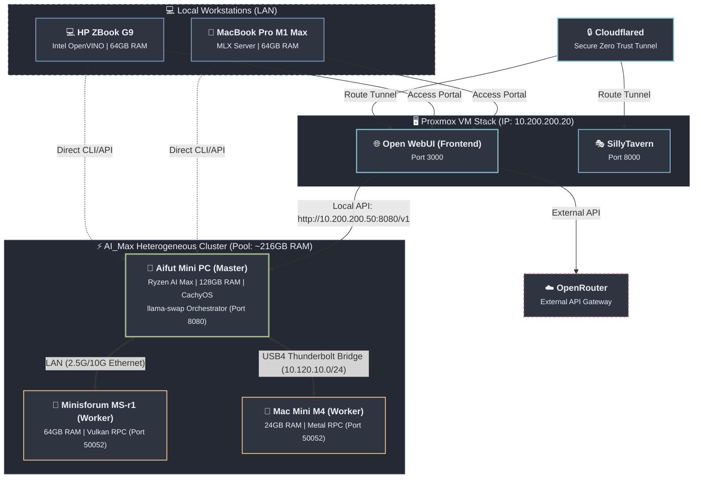

# Codelab & Homelab Local AI Infrastructure 🚀

Welcome to **Codelab**, the central hub for local AI tooling, automation configurations, and the wider documentation for the Homelab Local AI cluster and workstations.

---

## 🗺️ Repository Structure & Workflows (`Codelab`)

This repository is organized by hardware environments, tooling frameworks, and scripting workflows:

### 📂 Environments & Clusters
*   **[Cluster](./Cluster)**: Centralized configuration hub and orchestration scripts for the distributed AI cluster nodes.
*   **[AI_Max](./AI_Max)**: Host configurations, boot parameters, and custom AMD GPU/UMA allocations for the Ryzen AI Max+ 395 main node (Aifut).
*   **[Minisforum](./Minisforum)**: Vulkan RPC worker daemon setup and configurations for the Minisforum MS-R1.
*   **[Intel](./Intel)**: Deployment runtimes and Optimum-Intel / OpenVINO inference setups.
*   **[Mac](./Mac)**: MLX/Ollama modelfiles and launch configurations for Apple Silicon workstations.
*   **[Proxmox](./Proxmox)**: Hardened Docker compose stacks, virtualization-hosted microservices, and security profiles.

### 📂 Tooling & Workflows
*   **[CLI_Tools](./CLI_Tools)**: Configurations, system prompts, templates, and conversation logs for terminal-based LLM clients.
    *   **Clients Supported**: `opencode`, `gemini-cli`, and `claude`.
*   **[CLI_Tools/Automation/agent-config](./CLI_Tools/Automation/agent-config)**: Auto-injection setup for workspace rules.
    *   `inject-requirements.sh`: Watcher script (running as a systemd service) that automatically copies base configurations (`requirements.md` and `gemini.md`/`opencode.md`) into new project folders to guide AI models instantly.

---

## 🌐 Homelab Local AI Topology

The diagram below illustrates the physical nodes, virtualized backends, local workstations, and their network connections. 

---

## 💻 Node Specifications & Configurations

### 1. Heterogeneous AI Cluster (`AI_Max`)
A 3-node distributed inference cluster designed around `llama.cpp` RPC workers, pooled together to run massive models (up to 405B) at home.

*   **Total Pooled RAM**: ~216 GB
*   **Orchestration Backend**: `llama-swap` running on Aifut, exposing a unified OpenAI-compatible API at `http://10.200.200.50:8080/v1` for Open WebUI and local tools.
*   **Physical Topology**:
    *   **Aifut (Main Node)**: Ryzen AI Max (Strix Halo), 128GB RAM, running CachyOS.
        *   *GPU Backend*: ROCm/HIP (`-DGGML_HIP=ON -DAMDGPU_TARGETS=gfx1151`) for superior Strix Halo APU utilization.
        *   *BIOS*: VRAM/UMA Frame Buffer set to **Auto**; TDP set to **Performance** (54W+).
        *   *Boot arguments*: `amdttm.pages_limit=0`, `amdttm.page_pool_size=0`, `amdgpu.gttsize=122880` (enabling a ~120GB GTT limit).
    *   **Minisforum MS-r1 (RPC Worker)**: ARM64 architecture, 64GB RAM, running Debian 12.
        *   *GPU Backend*: Vulkan acceleration over ARM Immortalis-G720. Runs `llama-worker.service` (`rpc-server` on `10.200.200.60:50052`).
    *   **Mac Mini M4 (RPC Worker)**: 24GB Unified Memory, running macOS.
        *   *GPU Backend*: Metal acceleration. Runs `rpc-server` on `10.120.10.11:50052` (managed by `launchd` plist).
*   **High-Speed Interconnect**:
    *   Aifut connects to the Mac Mini via a direct **USB4/Thunderbolt Network Bridge** (`10.120.10.12` / `10.120.10.11`) with MTU 9000 and TSO optimizations enabled to handle high-bandwidth RPC layer sharding.
    *   Standard LAN connections (2.5GbE/10GbE) link Aifut and the Minisforum node.
*   **Storage Layout (AIfut Tiered Storage with SnapRAID)**:
    *   **Primary Landing Zone**: `/mnt/Data` (1 TB Internal NVMe) for high-speed model execution. (Soon to be upgraded to 4TB NVMe)
    *   **Expansion Enclosure**: ORICO 9858T3 5-bay USB4 / Thunderbolt 3 enclosure (authorized via `boltctl`, UUID: `c1010000-0072-740e-0392-1fe1d4b23009`), pooled using `mergerfs` under `/mnt/OricoPool` (~16 TB total storage).
        *   *Fast SSD Tier (~8 TB)*: 2 × 4TB ext4 SSDs (`/mnt/orico/ssd1` & `/mnt/orico/ssd2` in Bays 1 and 2). mergerfs is configured with `category.create=ff` to write to the SSD tier first.
        *   *Bulk HDD Tier (~8 TB)*: 2 × 4TB ext4 HDDs (`/mnt/orico/hdd1` & `/mnt/orico/hdd2` in Bays 3 and 4) for overflow model archiving.
        *   *SnapRAID Parity*: 1 × 4TB HDD (`/mnt/orico/parity` in Bay 5) protecting the pool against single drive failures. Content files are mirrored on `/mnt/orico/ssd1/.snapraid.content` and `/mnt/orico/hdd1/.snapraid.content`.
        *   *Automation & Robustness*: Nightly SnapRAID parity sync and scrub at 3:00 AM via systemd timers (`snapraid-sync.timer`). All drives are configured in `/etc/fstab` using UUIDs and `nofail,noatime,x-systemd.device-timeout=10` to guarantee clean boots even when disconnected.
*   **Model Strategy**:
    *   Models are stored exclusively on Aifut; `llama-server` shards layers dynamically to the RPC workers over the high-speed links.
    *   *Base Models*: MiniMax M2.5 (UD-Q4_K_XL), Step 3.5 Flash (Q4_K_M), Llama 3.1 405B (Q2_K & Q3_K_M), Qwen 3.5 122B (Q6_K / UD-Q6_K_XL).
    *   *Speculative Decoding*: 13 configured combos utilizing Qwen 3.5 draft models (4B, 9B, 27B, 35B-A3B) and Llama draft models (1B, 3B, 8B).
*   **Maintenance & Automation**:
    *   `upgrade_llama_cluster.sh`: Script triggers SSH-driven simultaneous rebuilds of `llama.cpp` on all nodes (workers first, then main server) to keep the cluster synchronized.

### 2. HP ZBook G9 Workstation (Intel Stack)
A standalone Intel-optimized AI station for local, low-latency text and vision workflows.

*   **Specs**: Intel Core i7-1260P, Intel Iris Xe (96 EU) GPU, 64GB RAM.
*   **Runtime Engine**: OpenVINO via Hugging Face `optimum-intel` implemented in `run_ultimate.py`.
*   **Key Optimizations**:
    *   **INT8 KV Cache Compression** (`KV_CACHE_PRECISION: u8`): Halves the memory footprint, enabling larger context windows.
    *   **Dynamic Activation Quantization** (`group_size=32`): Optimized for Xe-LP graphics cores lacking DP4a/XMX hardware.
*   **Model Registry**:
    *   General Reasoning: Qwen3 (8B int4, MoE 30B-A3B int4), Phi-4 Mini int4, Gemma 3 (4b-it int4).
    *   Coding: Qwen3 Coder MoE (30B-A3B int4).
    *   Creative / Uncensored: Dolphin 3.0 Llama 3.1 (8B) (converted using `convert_uncensored.sh` to OpenVINO format).

### 3. MacBook Pro Workstation (Mac/M1 Stack)
A local, private developer assistant environment.

*   **Specs**: MacBook Pro M1 Max, 64GB Unified Memory.
*   **Runtime Engines**: Ollama (v0.30.11+) and MLX Server (`launch_mlx_server.sh`).
*   **Model Options**:
    *   MLX optimized weights: Qwen3-Coder-Next Q6, Qwen3.6-40B Q5_K_M, Nex-N2-mini MXFP4.
    *   Ollama custom Modelfiles: Mako 32B Conductor, Dark Scarlett 35B, Arkoda 70B v2 Merged.
*   **Storage Utility**: `update_ollama_drive.sh` handles backup and model asset management.

### 4. Proxmox Docker Stack (Services & Security)
A hardened, containerized application stack acting as the client gateway for homelab users.

*   **OS**: Ubuntu Server VM hosted on Proxmox VE 8.4.0.
*   **Containerization**: **Rootless Docker** running under service user `appuser` (UID/GID 3001).
*   **Security Architecture**:
    *   **Dropped Capabilities**: All services enforce `cap_drop: - ALL` to minimize container privilege escalation vectors.
    *   **Resource Limits**: Strict CPU and memory ceilings (e.g., limits of 2 CPUs and 4GB RAM) prevent container-level resource exhaustion.
    *   **Network Isolation**: Contained inside the `app_net` bridge network, exposing frontend ports while isolating backends.
*   **Deployed Services**:
    *   `open-webui` (Frontend): Accessible locally on port `3000`. Wired to utilize both local `llama-swap` (`http://10.200.200.50:8080/v1`) and external OpenRouter API keys. Native/embedded Ollama integration is explicitly disabled (`ENABLE_OLLAMA_API=false`).
    *   `sillytavern` (Alternative Frontend): Accessible locally on port `8000`. Maps `/Data/sillytavern/` for persistent configurations, custom plug-ins, and extensions.
    *   `tunnel` (Cloudflared): Runs secure Cloudflare Zero Trust Tunnels utilizing `TUNNEL_TOKEN` mapped from host environment variable. Enables access to Open WebUI and SillyTavern from WAN without opening firewall ports, enforced via Cloudflare Access identity validation policies.

